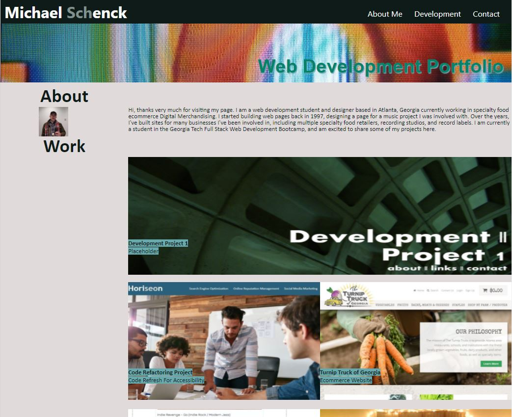

# Developer-Portfolio

## Description

This portfolio is intented to provide prospective employers with a easy-to-navigate demonstration of my web development and design skills through my history of deployed projects.

Link to deployed web application:
https://mdschenck.github.io/Developer-Portfolio/

The USER STORY for this project is as follows:

- AS A employer,
- I WANT to view a potential employee's deployed portfolio of work samples
- SO THAT I can review samples of their work and assess whether they're a good candidate for an open position.

Given this user story, I strove to provide examples of my web development and design work, past and present. Over the last 10 years, I have deployed multiple web applications ranging from static web sites to functional business websites with music players and embedded social feeds and payment, all the way up to fully featured ecommerce sites on Magento and WIX platforms that provided functionality sufficient to run a business and capture all payments, process orders, etc. Through my work in the Georgia Tech Full Stack Web Development Bootcamp, I hope to fill this portfolio with intriguing, functional web applications over the next six months, as well as projects focusing on my currrent work in ecommerce fulfillment and integrating web applications with our current Magento 2.0, AS4000, and Enterworks MANTIS PIM platforms.

## Useage

This is a basic web application that functions to give information about my web development and design portfolio, and give prospective employers insight into my development and design skills. It can be accessed via any modern and legacy web browser.

Link to completed project:

https://mdschenck.github.io/Developer-Portfolio/

This project meets the acceptance criteria of:

- When a user loads the portfolio, the user is presented with the developer's name, a recent photo, and links to sections about them and their work.
- When a link is clicked in the navigation bar, the UI scrolls to the corresponding section of the site.
- When the user is presented with the first application, the image is larger than that of the rest on the page.
- When the user clicks on the image of the application, the browser opens a link to that application.
- When the user resizes the page or views on a different device, they are presented with a responsive layout that adapts to the size of their viewport.

**REVISION 1: 3/26/22:**

** Based on feedback I have revised this project to address missing link to contents in Navigation Bar, added Media Query to make fully responsive design, and completely reworked the HTML and CSS to match the mock-up design from the assignment READ-ME.**

**REVISION 2: 04/24/22:**

\*\* Updated to include five of my best projects to date, including this module's group project. I am very proud to have populated this portfoloio with functional web applications in such a short period of time, and am looking forward to updating this again in another few weeks with more. Projects added for this round include: Endangered Species Wildlife Census (Group Project), Weather Dashboard, Work-Day Scheduler, Code Quiz, and Random Password Generator.

Site screengrab to demonstrate visible appearance of the deployed web application:

## Attribution:

Hero Banner & Footer Artwork:
Nam June Paik (Photo still taken by me in early 2000s), Smithsonian American Art Museum, Washington, DC.
